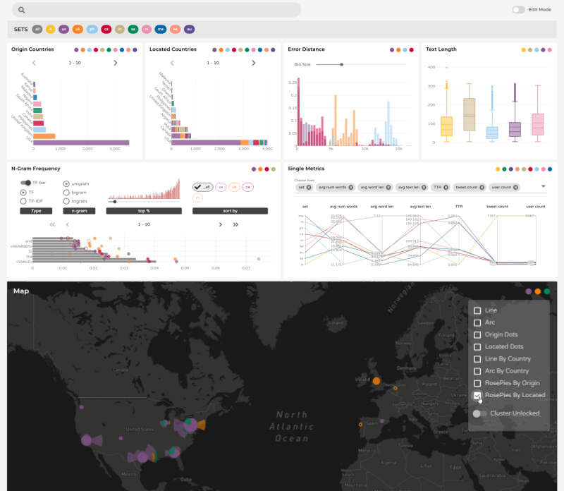

# Location Extraction Analyzer
A visual analytics tool for exploring results of tweet location extraction algorithms. Developed as [my master's thesis](thesis.pdf) project. Tweets provided here were modified for anonymization to meet Twitter's terms of service.



[DEMO Video](https://vimeo.com/488959635)

## Requirements
Recent versions of
* Node.js
* npm

## Setup
```
npm install
```

## Start the Server to Feed Tweets
```
node server.js
```

## Start the Vue App
In the separate terminal,
```
npm run serve
```
then open http://localhost:8080 in a browser.

[Configuration Reference](https://cli.vuejs.org/config/) for more Vue configurations.
